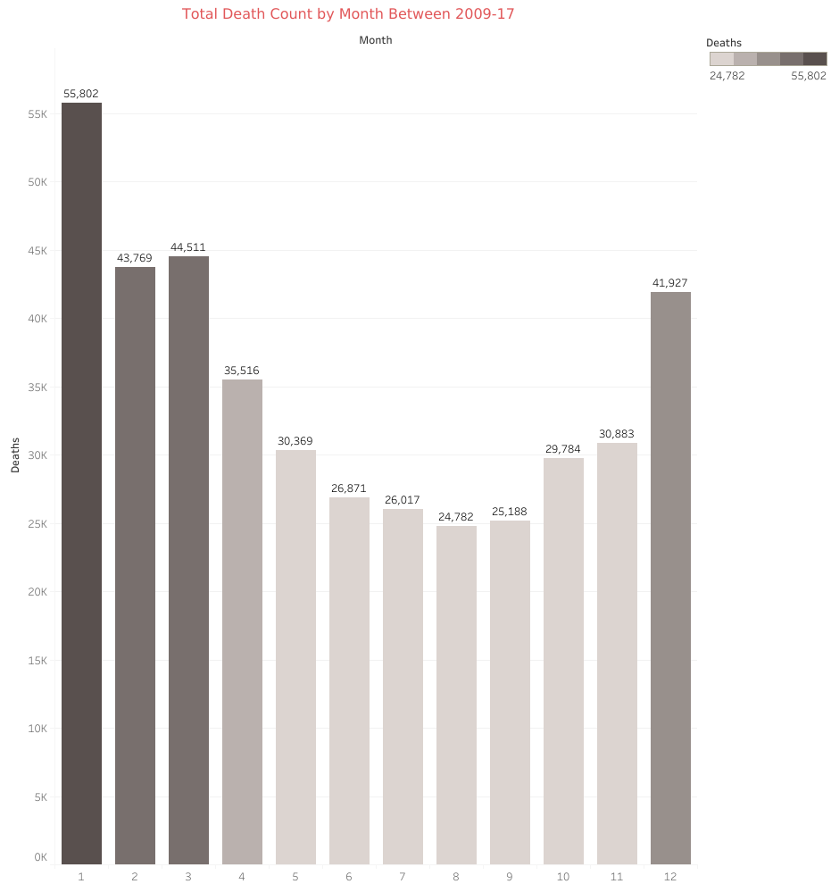

# Preparing for Influenza Season
###### This project was completed as a requirement for the Data Analytics Program by CareerFoundry

## Project Overview

### Motivation​:​ ​
##### The United States has an influenza season where more people than usual suffer from the flu. Some people, particularly those in vulnerable populations, develop serious complications and end up in the hospital. Hospitals and clinics need additional staff to adequately treat these extra patients. The medical staffing agency provides this temporary staff.
### Objective​:​ 
##### ​Determine when to send staff, and how many, to each state.
### Scope: 
##### ​The agency covers all hospitals in each of the 50 states of the United States, and the project will plan for the upcoming influenza season.

## Project Requirements
##### 1. Provide information to support a staffing plan, detailing what data can help inform the timing and spatial distribution of medical personnel throughout the United States.
##### 2. Determine whether influenza occurs seasonally or throughout the entire year. If seasonal, does it start and end at the same time (month) in every state?
##### 3. Prioritize states with large vulnerable populations. Consider categorizing each state as low-, medium-, or high-need based on its vulnerable population count.
##### 4. Assess data limitations that may prevent you from conducting your desired analyses.

### Stakeholder Identification
##### 1. Medical agency frontline staff (nurses, physician assistants, and doctors)
##### 2.Hospitals and clinics using the staffing agency’s services
##### 3. Influenza patients
##### 4. Staffing agency administrators

## Success Factors
### The project’s success will be based on:
##### A staffing plan that utilizes all available agency staff per state requirements, without necessitating additional resources
##### Minimal instances of understaffing and overstaffing across states (a state can be considered understaffed if the staff-to-patient ratio is lower than 90% of the required ratio and overstaffed if greater than 110%)

## Assumptions & Constraints

### Assumptions:
##### Vulnerable populations suffer the most-severe impacts from the flu and are the most likely to end up in the hospital.
##### Flu shots decrease the chance of becoming infected with the flu. 

### Constraints:
##### The staffing agency has a limited number of nurses, physician assistants, and doctors on staff.
##### There’s no money to hire additional medical personnel.

## Data

#### The following data sets covering influenza in the United States will be used during the project: https://coach-courses-us.s3.amazonaws.com/public/courses/da_program/CDC_Influenza_Deaths_edited.xlsx
##### 1. Influenza deaths by geography, time, age, and gender (Source:​ ​CDC)

##### 2. Population data by geography (Source: US Census Bureau): https://coach-courses-us.s3.amazonaws.com/public/courses/data-immersion/A1-A2_Influenza_Project/Census_Population_transformed_202101.csv
###### NOTE: keep in mind that these numbers are estimates, hence the sum of the numbers from the different age groups may not sum up to the total in the first columns, but that’s totally okay.

## Tools and Skills
#### Tools: Tableau and Microsoft Excel
#### Skills: Project Design, Data Sourcing, Data Profiling, Data Quality Measures, Data Transformation, Statistical Analysis/Hypothesis Testing, Forecasting, Creating an Interim Report, Data Visualizations/Dashboards, Storytelling/Presenting Data

## Link to Final Presentation
##### Tableau Storyboard: https://public.tableau.com/app/profile/tristan.savella/viz/StoryboardPlanningforInfluenzaSeason/StoryboardProject2_9
##### Final Presentation: https://www.youtube.com/watch?v=v-6jxMWetbA

## Steps to Analysis

##### 1. Create a list of project questions (Document 1.2)
##### 2. Design the project: create a project management plan, form potential hypotheses, and create a data "wishlist" (Document 1.3)
##### 3. Source the data: Two Datasets (see "Data" section below for more information 
##### 4. Data Profiling/Cleaning (Excel): Check for Data integrity issues, list data types, clean data, and conduct initial summary statistics
##### 5. Data Transformation: Merge/integrate the two datasets
##### 6. Statistical Analyses and Hypothesis Testing (See "interim_report")
##### 7. Create interim report
##### 8. Create data visualizations and final storyboard (Tableau)
##### 9. Record Final Presentation

## Insights

##### 1. Between 2012-17, flu season has consistently lasted from November-March (usually peaking in January). This is consistent in all states.

##### 2. The older the age group, the higher the flu-related death count and death rate. Older populations account for a vast majority of flu-relate deaths. 

##### 3. All age groups saw an increase in death counts between 2012-2013
##### 4. The 65-74 age group has seen a steady rise in death counts from 2012-17

##### 5. States with higher densities seem to have higher death counts. Examples include: 
###### 5a. New York vs. Texas: Texas is the 2nd most populous state and New York is the 3rd, however, New York has a much higher death count at over 40,000 to Texas' 26,000 (between 2012-17)
###### 5b. Massachussetts has a population of 6.5 million and a total death count of 11,000 between 2012-17. The large states (by land area) of Washington and Arizona have similar populations yet both have about 50% of MA's total number of deaths.
###### 5c. Hawaii has a population of 1.3 million and around 2,500 deaths. In comparison, the larger, less dense state of Idaho has a population of 1.6 million and only 586 deaths.

##### 6. States on the east coast typically see higher death counts than in the rest of the country

## Recommendations
##### 1. Further research: Look into possible correlation between population density and death count/rate
##### 2. Further research: Look into why the 65-74 age group specifically has had a steadily increasing death count since 2012 (the only age group to do so)
##### 3. Place most of the medical staffing on states with high populations (particularly older populations), states with high population-density, and states on the east coast (for easier inter-state travel as needed)
##### 4. Expect flu season to peak between November-March. Begin increasing medical staffing leading into November and decreasing beginning in March/April, as needed. Further analysis needed to determine how to implement the increase/decrease in staffing
